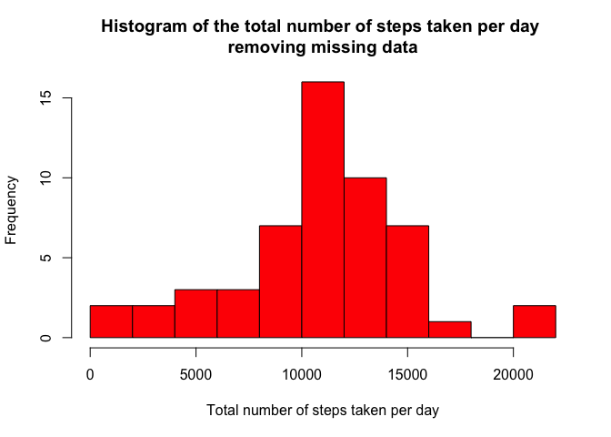
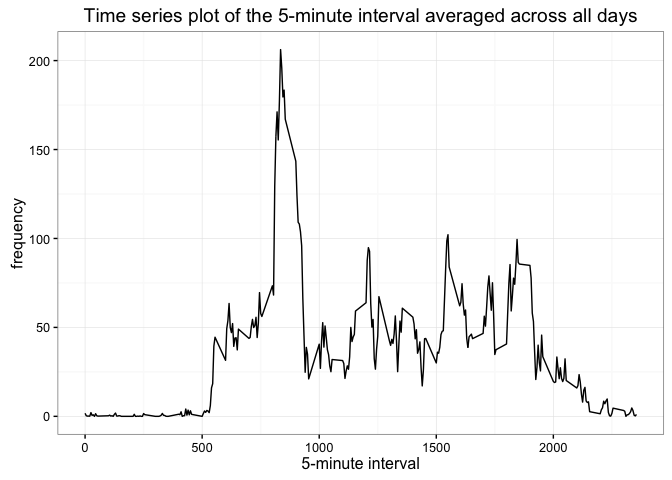
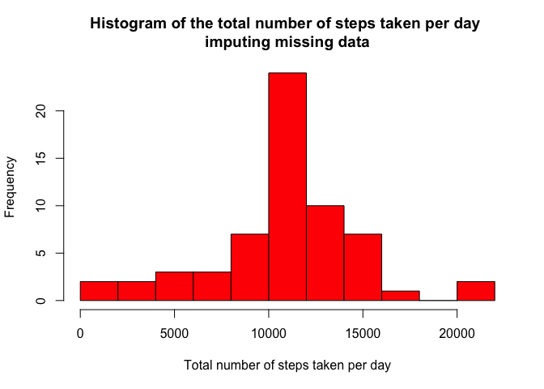
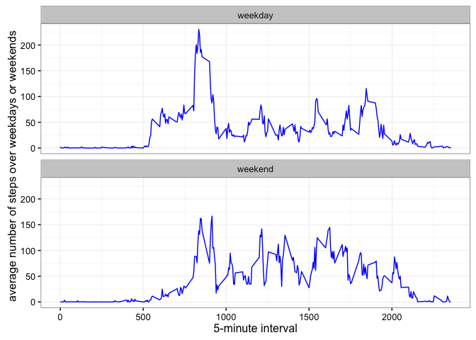

# ReproducibleResearchProject1
Yuyu Zeng  
September 25, 2016  

# Data analysis about personal movement using activity monitoring devices
This project makes use of data from a personal acitivity monitoring devices. From this dataset, we try to utilize it to gain insight about how to improve personal health or to find patterns in personal behavior. The monitoring device collects data at a 5 minute intervals throughout the day. The data consists of two months of data from an anonymous individual collected during the months of October and November, 2012 and include the number of steps taken in 5 minute interval each day. 


## Load the data
1. Set the working directory as the same file folder as where the data is stored.  
2. Load the knitr, ggplot2 (for plotting figures) package.   
3. Load the data set.   

```r
setwd("/Users/yuyu/Desktop/DataScientist/ReproducibleResearch/week2")
library(knitr)
```

```
## Warning: package 'knitr' was built under R version 3.2.5
```

```r
library(ggplot2)
dat <- read.csv("activity.csv", header=TRUE)
```

## Mean total number of steps taken per day
1. Note that in all the calculations in this part, all missing values are removed from the data set.   
2. Calculate the total number of steps taken per day.    
3. Make a histogram of the total number of steps taken each day.    
4. Calculate and report the mean and median of the total number of steps taken per day.    


```r
dat_rm <- na.omit(dat)
stepsperday_rm <- aggregate( steps ~ date, data=dat_rm, FUN=sum)
hist(stepsperday_rm$steps, xlab = "Total number of steps taken per day", main = "Histogram of the total number of steps taken per day \nremoving missing data", col= "red", breaks = 10)
```

<!-- -->

```r
mean(stepsperday_rm$steps)
```

```
## [1] 10766.19
```

```r
median(stepsperday_rm$steps)
```

```
## [1] 10765
```

## Average daily activity pattern
1. Make a time series plot of the 5-minute interval (x-axis) and the average number of steps taken, averaged across all days (y-axis).  
2. Find which 5-minute interval, on average across all the days in the dataset, contains the maximum number of steps.


```r
averages <- aggregate(x = list(steps = dat$steps), by = list(interval = dat$interval),FUN = mean, na.rm=TRUE)
ggplot(data = averages, aes(x = interval, y = steps)) +
  geom_line() + ggtitle("Time series plot of the 5-minute interval averaged across all days")+theme_bw()+xlab("5-minute interval")+ylab("frequency")
```

<!-- -->

```r
averages[which.max(averages[,2]),1]
```

```
## [1] 835
```
The 5-minute interval, on average across all the days in the data set, containing the maximum number of steps is 835.


## Imputing missing values
1. Calculate and report the total number of missing values in the dateset.  
2. Fill in all of the missing values using the mean for that 5-minute interval.  
3. The new dataset ``dat" is equal to the original dataset but with the missing data filled in with the mean for that 5-minute interval.  
4. Make a histogram of the total number of steps taken each day and Calculate and report the mean and median total number of steps taken per day.   

```r
sum(is.na(dat))
```

```
## [1] 2304
```

```r
for (i in 1:nrow(dat)) {
    if (is.na(dat[i,1])) {
        dat[i,1]=averages[which(averages$interval==dat[i,3]),2]
        }
} 
stepsperday <- aggregate(steps ~ date, data=dat, FUN=sum)
hist(stepsperday$steps, xlab = "Total number of steps taken per day", main = "Histogram of the total number of steps taken per day \nimputing missing data", col= "red", breaks = 10)
```

<!-- -->

```r
mean(stepsperday$steps)
```

```
## [1] 10766.19
```

```r
median(stepsperday$steps)
```

```
## [1] 10766.19
```

## Differences in activity pattern between weekdays and weekends
1.Create a new factor variable in the dataset with two levels ``weekday" and ``weekend" indicating whether a given date is a weekday or weekend day.  
2. Make a panel plot containing a time series plot of the 5-minute interval (x-axis) and the average number of steps taken, averaged across all weekday days or weekend days (y-axis). 

```r
dat$date <- as.Date(dat$date)
weekends <- c("Saturday","Sunday")
for (i in 1:nrow(dat)){
  if (weekdays(dat$date[i]) %in% weekends)
  {dat$dow[i]="weekend"}
  else
  dat$dow[i]="weekday"
}
averages <- aggregate(x = list(steps = dat$steps), by = list(dow = dat$dow, interval=dat$interval),FUN = mean, na.rm=TRUE)
ggplot(data = averages, aes(x = interval, y = steps)) +
  geom_line(color="blue") + facet_wrap(~dow, ncol=1) +
  xlab("5-minute interval") +
  ylab("average number of steps over weekdays or weekends")+theme_bw()
```

<!-- -->
